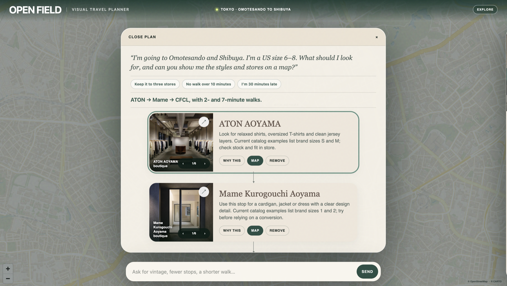
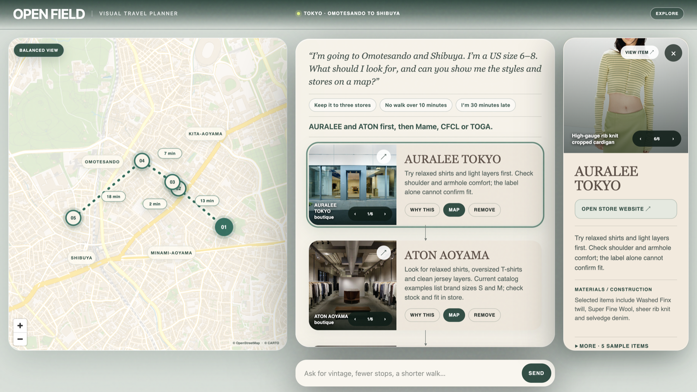

# Open Field

Open Field is a visual travel-planning agent that turns a natural-language request into an editable route rather than a prose itinerary. The response is a map-linked interface with sourced store imagery, route alternatives, walking constraints, evidence panels, and follow-up actions.

Built for the ClickHouse × Trigger.dev AI Hackathon 2026.

## Demo

- [Loom demo](https://www.loom.com/share/4561a55985e1479cbe74cbe8221c9564)

Try Open Field with a request like:

> I’m going to Omotesando and Shibuya. I’m a US size 6–8. What should I look for, and can you show me the styles and stores on a map?

Open Field responds with an illustrated route that can be adjusted directly: reduce the number of stops, limit walking time, focus any store on the map, or add vintage shopping as a follow-up.



Selecting a store connects the route, map pin, product imagery, and supporting details in one view.



## Why this is an agent response

The agent returns a validated visual-response manifest. The client renders that manifest into local interface components—route cards, map pins, evidence carousels, route branches, and bounded follow-up actions. The model does not generate arbitrary HTML.

- **Trigger.dev:** `chat.agent()` owns the durable chat session and invokes the typed `composeShoppingRoute` tool.
- **ClickHouse:** the primary runtime data layer for approved places, coordinates, provenance, and response-run records.
- **OpenAI:** interprets free-form follow-ups and selects bounded tool inputs.
- **Cloudflare Workers:** serves the vinext application and the session endpoint.

A source-backed preview keeps the last valid visual route available if a model or network request fails.

## Architecture

```text
User prompt
  → Trigger.dev chat.agent()
  → typed composeShoppingRoute tool
  → read-only ClickHouse query
  → validated TravelResponse manifest
  → React route/map/evidence components
```

Key files:

- `trigger/compose-shopping-route.ts` — Trigger.dev `chat.agent()` definition.
- `src/clickhouse/client.ts` — bounded ClickHouse repository and response-run persistence.
- `src/runtime/compose-shopping-route.ts` — provider-independent route composer.
- `src/contracts/travel-response.ts` — validated response contract.
- `src/contracts/visual-response-catalog.ts` — allowed visual actions and component catalog.
- `app/page.tsx` — interactive route, map, evidence, and follow-up UI.
- `clickhouse/schema.sql` — ClickHouse tables.

## Required-stack evidence

### Trigger.dev

- `trigger/compose-shopping-route.ts` defines the required durable agent with `chat.agent()`.
- Every agent turn is forced through the typed `composeShoppingRoute` tool rather than returning a prose-only itinerary.
- `TriggerChatTransport` connects the React chat UI to the durable agent session.
- `app/api/chat/session/route.ts` starts the session server-side and returns only a short-lived public access token.

### ClickHouse

- ClickHouse is the primary runtime database for approved place rows, coordinates, provenance, and generated response manifests.
- `ClickHouseShoppingRepository.findShoppingPlaces()` executes the route query used by the agent tool.
- The query accepts only `runtime_enabled`, `public_demo_allowed`, `privacy = 'public_demo'` rows and applies read-only, row-count, query-count, and execution-time limits.
- `recordResponse()` writes each validated visual-response manifest to `response_runs`.

## Safety and limits

- Only rows marked `runtime_enabled`, `public_demo_allowed`, and `privacy = 'public_demo'` are queried.
- ClickHouse requests are read-only and capped by query count, rows, and execution time.
- OpenAI output tokens and Trigger.dev steps are capped per run.
- The public repository contains no credentials, private trip records, or local source paths.
- Product availability, prices, hours, and walking estimates are labeled as snapshots rather than live guarantees.

Provider-side billing limits should still be configured in the OpenAI, Trigger.dev, and ClickHouse dashboards.

## Local setup

Requires Node.js 22.13 or newer.

```bash
npm install
cp .env.example .env.local
npm run seed:preview
npm run build
npm run dev
```

Fill the following values in `.env.local`:

- `TRIGGER_PROJECT_REF`
- `TRIGGER_SECRET_KEY`
- `OPENAI_API_KEY`
- `OPENAI_MODEL`
- `CLICKHOUSE_URL`
- `CLICKHOUSE_USERNAME`
- `CLICKHOUSE_PASSWORD`
- `CLICKHOUSE_DATABASE`

Deploy the Trigger.dev task before using the live agent path:

```bash
npx trigger.dev@latest deploy
```

Deploy the web app with Wrangler:

```bash
npx wrangler deploy
```

## Verification

```bash
npm run lint
npm run typecheck
npm test
```

The test suite covers the response schema, Trigger session boundary, ClickHouse query restrictions, usage budgets, fashion and vintage route constraints, walking legs, map geography, visual actions, rendered HTML, and optional watch/hotel visual studies.

## License and media

Source code is available under the MIT License. Third-party map data, map tiles, store/product imagery, trademarks, and factual source material remain the property of their respective owners and are not relicensed under MIT. See [THIRD_PARTY_NOTICES.md](THIRD_PARTY_NOTICES.md).
